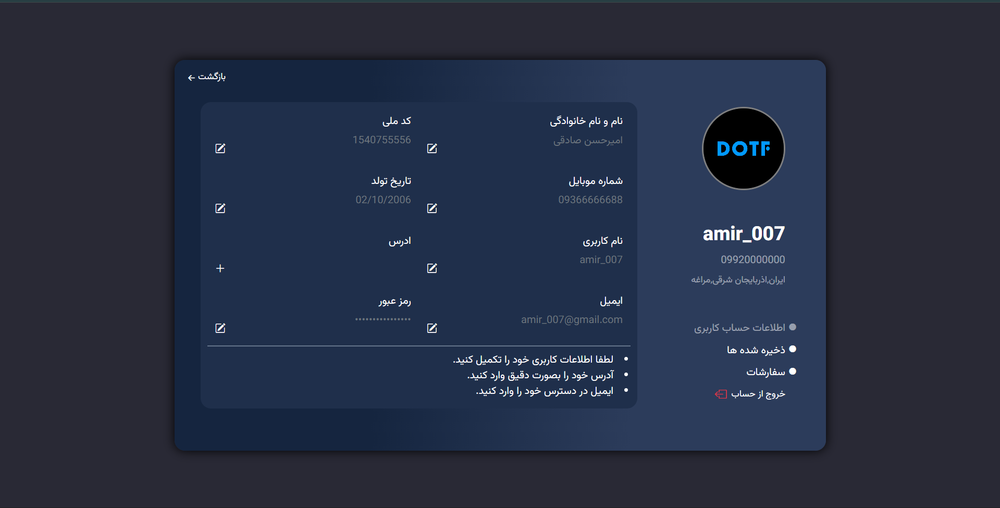
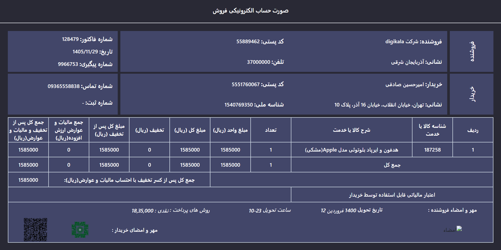

# 🧑‍💼 E-commerce User Profile & Invoice (RTL)

User profile and invoice pages for an e-commerce website with RTL support and dark UI.

## ✨ Key Features
- User profile page with editable information
- Saved items section for bookmarked products
- Invoice (order summary) page
- Dark UI
- RTL (Persian / Farsi) layout
- Responsive profile page
- Desktop-oriented invoice page

## 🖼️ Preview

### Profile Page

### Invoice Page

## 🛠️ Technologies
- HTML5  
- Tailwind CSS (main styling)
- Bootstrap (partial usage)
- CSS
- JavaScript (Vanilla)

## 🚀 How to Run
Simply open the `index.html` file in your browser.

No build tools or dependencies required.

## 🎯 Project Purpose
This project was created to:
- Practice Tailwind CSS in a real-world e-commerce UI
- Build RTL-friendly layouts
- Design user account and invoice interfaces
- Identify and plan responsive improvements

## 🔮 Future Improvements
- Make invoice page fully responsive
- Dynamic invoice data
- Backend & API integration
- User authentication
- Convert UI into React components
  
## 👤 Author
**Amirhossein**

- GitHub: [amiraeone](https://github.com/amiraeone)

---
⭐ If you like this project, feel free to give it a star!
